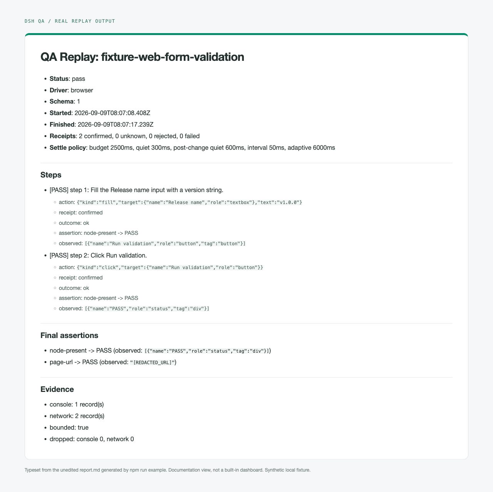

<h1 align="center">DSH QA</h1>

<p align="center">
  <strong>像用户一样探索真实应用，留下证据，再把验证过的动作变成可重复的 QA 场景。</strong><br />
  <sub>Agent 主导探索 &bull; 证据支撑的断言 &bull; 确定性回放 &bull; 浏览器、桌面、iOS 与 Android</sub>
</p>

<p align="center">
  <sub>包名：<code>@zseven-w/dsh-qa</code> &middot; 版本：<code>0.1.0-rc.2</code> &middot; 预发布阶段</sub>
</p>

<p align="center">
  <a href="./README.md">English</a> &middot; <a href="./README.zh.md"><b>简体中文</b></a>
</p>

<p align="center">
  <a href="#快速开始">快速开始</a> &middot; <a href="#安全与限制">安全与限制</a> &middot; <a href="#已知缺口">已知缺口</a> &middot; <a href="#开发">开发</a> &middot; <a href="#文档入口">文档入口</a>
</p>

<p align="center">
  
</p>
<p align="center"><sub>随包示例的真实输出：两个步骤与最终断言均通过。这是未经编辑的 Markdown 报告的排版视图，不是内置仪表盘，也不代表四端覆盖。</sub></p>

## 为什么是 DSH QA

面向 DeepSeek Harness 的 QA 编排插件：Agent 像真实用户一样**探索**你的 App（发现的问题都带证据），随后把探索出的路径导出为确定性的 **Replay** 场景，在每次发版时跑。

- **Explore 模式** —— Agent 通过一组工具驱动应用（`qa_session_start` / `qa_observe` / `qa_act` / `qa_assert` / `qa_evidence` / `qa_record_export` / `qa_replay_run` / `qa_session_stop`），并记录它看到的一切。
- **Replay 模式** —— 声明式 `QaScenario` 文件（无损 JSON）确定性执行，每一步动作后都用新观察验证断言，产出经脱敏的 JSON / Markdown / JSONL 报告。
- **驱动** —— `@zseven-w/dsh-browser`（BU，契约 v9）、`@zseven-w/dsh-computer`（CU，契约 v5）、`@zseven-w/dsh-ios`、`@zseven-w/dsh-android`。驱动的安全语义只继承、不放宽：`EXTERNAL_COMMIT_TARGET` 一律拒绝，安全字段永久拒绝，审批门禁原样透传，`unknown` 回执必须重新观察。移动端会话必须显式指定设备 id，绝不回落到默认设备。移动端文本输入是有条件实现、不是一刀切：iOS 的 `fill`/`type` 只在实时驱动暴露了 dsh-ios 原生的、绑定到元素的 `fillTarget`/`typeTarget` 原语时才可用，缺方法或缺原生标识符时明确标为不可用，绝不回落到裸的全局输入；Android 的 `type` 在验证真实焦点后保持追加语义，Android 的 `fill` 仍是 `FILL_PRIMITIVE_UNAVAILABLE`。

QA 只是编排四个独立驱动，它不替代驱动，也不扩大任何权限。fixture、单元测试或设备验收通过，只是那个被测范围内的证据，不代表所有应用都被支持。

## 快速开始

需要 Node.js **24.11.0 或更高**。QA 编排的驱动并不包含在它自己包里：只有当会话请求某个平台时，它才按包名惰性加载对应驱动。**只装 `@zseven-w/dsh-qa` 是一个驱动都没有的**——`qa_session_start` 会直接报驱动未安装。按需把驱动装在旁边：

```bash
npm install @zseven-w/dsh-qa           # 编排器本体
npm install @zseven-w/dsh-browser      # 浏览器会话
npm install @zseven-w/dsh-computer     # macOS 桌面会话
npm install @zseven-w/dsh-ios          # iOS 真机 / 模拟器会话
npm install @zseven-w/dsh-android      # Android 真机 / 模拟器会话
```

| 驱动 | 包名 | 职责 | 额外前提 |
| --- | --- | --- | --- |
| Browser（BU） | [`@zseven-w/dsh-browser`](https://github.com/ZSeven-W/dsh-browser) | 浏览器观察与交互 | 本机已安装 Chrome / Edge / Chromium；驱动只会去发现，绝不下载浏览器 |
| Computer（CU） | [`@zseven-w/dsh-computer`](https://github.com/ZSeven-W/dsh-computer) | 原生桌面观察与交互 | macOS；本地构建并授权的 Helper（辅助功能 + 屏幕录制）——见[已知缺口](#已知缺口) |
| iOS | [`@zseven-w/dsh-ios`](https://github.com/ZSeven-W/dsh-ios) | 显式设备的移动端会话 | macOS + Xcode；显式设备 id |
| Android | [`@zseven-w/dsh-android`](https://github.com/ZSeven-W/dsh-android) | 显式设备的移动端会话 | adb；显式设备 id |

装完后用随包的浏览器示例验证，它只需要 `dsh-qa`、`dsh-browser` 和一个本地浏览器：

```bash
node node_modules/@zseven-w/dsh-qa/scripts/run-example.mjs
```

它会把随包的 web fixture 服务在一个临时 loopback 端口上，无头回放一个两步场景，并写出 JSON / Markdown / JSONL 报告。装好的环境会打印 `[example] status: pass`。细节见[运行随包示例](#运行随包示例)。

如果要在 DSH 宿主里用，先安装或更新 DSH：

```bash
npm install -g @deepseek-ai/dsh@latest
```

安装 DSH **不会**自动激活本插件。它的宿主入口声明在 [`cordis.patch.yml`](./cordis.patch.yml)；独立的 stdio MCP 入口是 [`src/server.mjs`](./src/server.mjs)，也通过 `npm run mcp` 和 [`.mcp.json`](./.mcp.json) 暴露。开始会话前，先让所选宿主加载插件/服务并提供所需驱动。探索流程（观察 → 动作 → 断言 → 证据 → 导出）按 [Explore playbook](./skills/qa-explore/SKILL.md) 走。

## 安全与限制

- **不制造假绿：** `unknown` 动作回执必须有新证据。运行结果只有 `pass`、`inconclusive`、`fail`；覆盖不到不等于不存在。
- **不扩权：** 驱动的审批照常生效。安全字段与 `EXTERNAL_COMMIT_TARGET` 一律拒绝；移动端会话必须显式指定设备 id，没有默认设备回落。
- **回放需要持久目标：** 坐标、临时引用、有歧义的选择器都不会被提升进持久场景。没有稳定且可证明结果的动作会被排除在导出之外。
- **视觉是 advisory：** 视觉断言辅助定位问题，但不决定运行状态。模型的叙述不是观察到的事实。
- **移动端支持是有条件的：** iOS 文本输入要求实时的、绑定元素的原生原语和标识符。Android 的 `type` 会验证真实焦点；Android 的 `fill` 仍不可用。
- **证据需要谨慎对待：** 结构化报告走 fail-closed 脱敏，但截图里仍可能有隐私内容。请用合成测试数据，分享前先检查产物。登录态注入需要 owner 对确切 origin 的显式授权，见[登录态](./docs/LOGIN_STATE.md)。

## 已知缺口

这是一个开发者版本。主链路——浏览器与桌面上的 Explore → 证据 → Export → Replay——每次改动都会被测试套件跑一遍；但下面这些是开放问题，诚实使用这个包的前提是知道它们。

- **Computer Helper 没有公证。** 它是 adhoc 签名，没有 TeamIdentifier，也没有 stapled 票据，所以桌面这半边没有「装完即用」的体验：你需要从 [`dsh-computer`](https://github.com/ZSeven-W/dsh-computer) 工作区自己构建 Helper，并自己授予辅助功能 + 屏幕录制权限。Developer ID 签名与公证都还没做。
- **「不存在」很难证明，结果多半是 inconclusive 而不是通过。** `node-absent` 只在判定视图完整、**且**浏览器驱动的有界 closed-shadow-root 探测验证了覆盖时才通过。探测一旦发现 closed root、超出节点预算、或开不出 CDP 会话，结果就是 `COVERAGE_UNVERIFIED` / `INCONCLUSIVE_TRUNCATED`，并点名 `closed-shadow-root` 或 `shadow-coverage-unverified`——绝不会给通过。这是安全的失败方向，但在大量使用 shadow DOM 或页面很大的场景下，你应当预期拿到「未证明」而不是绿色的「不存在」。
- **大页面上的深层目标只能是 inconclusive。** 超出驱动 100 节点观察窗口后，限定范围的滚动证明最多只能到 `INCONCLUSIVE_SCOPE`，永远拿不到 `pass`。这是诚实，不是坏掉——但它意味着大页面上的深层流程今天产不出绿色门禁。
- **视觉断言是 advisory，而且这里的实时视觉链路未经验证。** 视觉按设计从不改变 Replay 的 pass/fail。通向真实宿主视觉服务（`ctx.llm` / `attachments`）的接缝在测试里只由 fake 覆盖，尚未对着真实视觉模型跑通。
- **移动端驱动没有契约版本。** Browser 钉在契约 v9、Computer 钉在 v5，但 `dsh-ios` / `dsh-android` 的 `/driver` 不导出版本；QA 靠结构化鸭子类型加载它们，所以漂移只能事后发现，而不是在加载时就拦住。

Replay 验证五类语义断言。`pass` 的含义是这些断言在新观察上成立——不代表应用是对的，不代表画面看着没问题，也不代表覆盖是完整的。

## 实现参考

<details>
<summary>会话语义、回放、观察完整性与宿主集成</summary>

### 会话内核

`src/session/` 在驱动适配器接口之上实现 QA 循环 `观察 -> 动作 -> 重新观察 -> 判定 -> 证据 -> 清理`，并带这几条硬规则：

- `unknown` 动作回执永远不算成功——结果只由一次新的观察决定；
- `rejected` / `failed` 回执作为步骤失败向上传播，回执本身作为证据附上；
- 每个会话即使失败也一定清理（`driver.stop`）。

`src/adapters/browser.ts` 把 `@zseven-w/dsh-browser`（以 `link:../dsh-browser` 的形式声明在 `devDependencies`，绝不是运行时依赖，也绝不内联进包）适配到该接口，过程中不放宽任何驱动安全语义。`fixtures/web/index.html` 是一个自包含的 loopback fixture，复现 2026-08-25 的验收流程。

原生（Computer 驱动）fixture `fixtures/native/` **按决策只留在仓库里（QA-BL-042，2026-09-05）**：它是由 `main.swift` 构建出的、已签名的 macOS app bundle，不进发布包。在工作区里用 `node fixtures/native/build-fixture.mjs` 构建，启动 `fixtures/native/build/DshQaFixture.app`，用 `pkill -x dsh-qa-fixture` 停止。它是演示 Computer 驱动「安全字段永久拒绝」（"Secure password"，`fixture.securePassword`）的唯一隔离目标，由 `test/computer-integration.test.mjs` 驱动。

### 回放

声明式 `QaScenario` 文件（无损 JSON，`{ meta, target, steps[], assertions[] }`）由 `src/replay/runner.ts` 在会话内核之上确定性执行。每一步都带着动作，以及该动作之后必须在**新**观察上成立的断言；`unknown` 回执永远不是通过——只有重新观察才有判定权。fail-closed 的加载器（`src/replay/loader.ts`）拒绝未知字段、畸形步骤、缺失字段和非无损值，且不回显值字节。报告器通过 `src/redaction` 里的 fail-closed v2 引擎产出脱敏后的 `report.json` / `report.md` / 只追加的 `report.jsonl`。参见 `scenarios/examples/` 与 `qa_assert` / `qa_replay_run`。

### Explore → Replay

`src/explore/` 把现有驱动适配器包成一个被动记录器。它在套用 fail-closed 脱敏投影之后，按顺序记录观察、动作、回执和证据引用；会话内核本身不变。临时的驱动 ref 会被替换成会话内的关联别名，绝不进入轨迹。

`qa_record_export` 接受一个位于当前工作区或临时目录下的 `output_path`，从该动作之后**已稳定**的新观察合成每一步的断言，写出场景文件，再通过现有的 fail-closed 加载器把写出的确切字节读回来。被拒绝/失败的动作、没有新观察的动作、以及视图始终没稳定下来的动作，都会出现在 `excludedActions` 里，绝不会被悄悄提升成步骤。

选择器的持久性是刻意严格的。浏览器目标要求唯一且非空的 **role + 可访问名**；computer 目标用持久的 Accessibility 标识符；移动端目标优先用稳定的 Android resourceId / iOS AXUniqueId。下标、坐标、观察 id、生成 id、重名、无名节点和临时 ref 一律拒绝，而不是去猜。`unknown` 回执还额外需要一个可观察的语义变化或 URL 变化；旧目标只是「还在」不构成证明。

Explore 方法论以两份产物交付：`skills/qa-explore/SKILL.md` 的人类可读副本（包含在包的 `files` 里），以及插件真正通过可选 skill 服务注册的 playbook——`src/skill.ts` 里的 `QA_SKILL_CONTENT` 模板字面量，经 `ctx.inject(['skills'], …)` 以 `qa-orchestration` 之名注册。

### 有界 settle（异步 UI）

真实 UI 是异步的，所以动作之后立刻取一次证明观察其实是竞态：它可能错过还没渲染出来的结果，也可能抓到无关的迟到 hydration 抖动并把它当成结果。`src/session/settle.ts` 用有界 settle 取代这种一次性读取：持续观察，直到语义投影（排除 ref 及其他会话内标识）在 `QA_SETTLE_QUIET_MS` 内保持不变，整体受 `QA_SETTLE_BUDGET_MS` 约束；并且在动作刚发生之后，绝不从「安静」本身得出结论。

会话内核对 Explore 的证明观察和 Replay 的验证观察套用**同一套**策略，所以两侧不可能对同一页面看到不同的视图。始终不稳定的视图就是诚实地不可证明：导出会排除该步骤（`ASSERTION_NOT_PROVABLE`），回放会让该步骤失败。没有任何东西会为了让不稳定的页面通过而被放宽。断言合成优先采用动作目标上或附近的证据，当只有较远的变化可用时，会把这一弱点记进步骤意图。`fill` 在自己目标上的值回显会从「是否变化」的判定里屏蔽掉（那是预期内的，不是下游结果的证据），并且只要稳定后的视图显示目标带着输入的文本，导出器就会用一条针对该目标的 `node-value` 断言来证明这次 fill。

配置方式：`new QaToolHost({ settle: ... })`、`runScenario(..., { settle: ... })`，或环境变量 `DSHPLUGIN_QA_SETTLE_BUDGET_MS` / `DSHPLUGIN_QA_SETTLE_QUIET_MS` / `DSHPLUGIN_QA_SETTLE_INTERVAL_MS`。完整推理、两种复现出来的真实失效模式，以及回归 fixture：`docs/SETTLE.md`。

### 被截断的视图是不完整，不是空

观察受预算限制，并带 `truncated` 标记。超出预算的节点依然存在，所以**绝不能从被截断的视图证明「不存在」**：`node-absent` 在那里 fail-closed，而不是报一个静默的假绿；任何会建立在不完整视图上的结论，都会先以 `QA_ESCALATED_NODE_BUDGET` 重新观察**一次**再下结论。在更完整的视图上依然无法证明的主张，会带上 `completeness.reason: "INCONCLUSIVE_TRUNCATED"`——与普通失败区分开；而**已经返回**的节点仍是「存在」的可靠证据。只要截断影响过某个判定，`completeness` 块（预算、截断状态、升级情况）就会写进 `report.json`、`report.jsonl`，并在 `report.md` 里出现一行 "view completeness"。回放执行器用同样的方式解析动作目标，导出器会把被截断的证明观察记为步骤意图里的 `Weak proof:` 备注。完整推理：`docs/TRUNCATION.md`。

**「不存在」要通过，必须有已验证的覆盖（QA-BL-052 -> C2，契约 v9）。** `node-absent` 的含义是「没有驱动**可观察**的语义节点」——驱动的投影会排除隐藏元素和零矩形元素——它通过的条件是：没有任何匹配，**且**做判定的那个视图是完整的（`truncated: false`），**且** `coverage.verified: true`：终局的「不存在」判定会在它**唯一**那次判定性重新观察上请求驱动的有界 closed-shadow-root 探测（绝不在 settle 轮询上做；限定范围时约 5 ms，在超大页面上做整页探测可能超预算——那样这个「不存在」就是 UNPROVEN）。探测若发现了 closed shadow root 或没有完成，结果保持 `INCONCLUSIVE_TRUNCATED` / `COVERAGE_UNVERIFIED`，并在 `completeness.detail` 和 `truncationReasons` 里点名 `closed-shadow-root` / `shadow-coverage-unverified`；通过的「不存在」会打印 "No driver-observable semantic node matching {predicate} was found within {scope|the whole page}; coverage verified (N nodes probed). K hidden candidates excluded."。返回了匹配节点依然照常让 `node-absent` 失败，`INCONCLUSIVE_TRUNCATED` 的语义不变。

### 限定范围观察（浏览器驱动契约 v9）

浏览器的钳制仍是 100 节点，而真实页面远超这个数，所以 `qa_observe` 接受 `within_ref`——一个来自调用方**当前**观察的不透明 ref——只观察以该元素为根的组合子树。预算、字节上限、扫描窗口和 iframe 标记都变成**相对子树**的：子树装得下的容器会报 `truncated: false` 且没有 `truncationReasons`，整页窗口里够不到的深层目标因此变得可达。限定范围的 `node-absent` 只在判定性重读的覆盖探测验证了**该子树**时才通过（见上）。观察的 `scope` 字段（`{ ref, rootRef, role, name, tag }`）回显驱动实际观察的根；`rootRef`（契约 v9）是每次观察新生成的 ref，即使可见性门禁把根隐藏了，它也能把下一次限定范围读取串起来。整页观察不带这些字段。未知、过期、已消费、非元素或已脱离文档的 ref 会带着驱动错误码（`REF_UNKNOWN` / `REF_EXPIRED` / `TARGET_CHANGED` / …）拒绝调用——绝不回落到整页，也绝不报「没找到」。computer 驱动不支持限定范围，会拒绝 `within_ref`。

限定范围观察会流进 Replay：场景断言可以带 `scope: { role, name, tag?, path? }`（空名按字面保留；`path` 是容器在录制时的语义祖先链，最外层在前，有就记录——这是更强的回放定位符）。执行器在整页视图里按**唯一**谓词加上已记录的 path 来解析该容器（有歧义时报 `TARGET_NOT_UNIQUE`，绝不猜）。在一个**被截断**的整页视图里只匹配到一个，并不证明唯一性：没有 path 的非滚动证明 scope 会把预算升级一次，若视图仍被截断则以 `INCONCLUSIVE_TRUNCATED` 拒绝并点名该 scope；而限定范围的**滚动**证明步骤——或任何带已记录 path 的 scope——会以**暂定**方式解析。暂定解析意味着该步骤带 `scopeResolution: 'provisional'` 与 `reason: INCONCLUSIVE_SCOPE`，**绝不是 pass**：容器可能是错的那个（窗口外的孪生体），所以 PASS 只留给已证明的解析。被回放的滚动依然会执行，并通过驱动的身份锚点验证（验证性读取上的 `anchorLastAction`）：锚点必须报告原始被操作元素仍连接在文档上、包含在该容器内、且在视口中，**并且**绑定到与被断言目标**相同**的节点 ref——绑定丢失或不匹配会作为步骤上的 `scopeRefusal` 披露出来，绝不按谓词重新选择。运行状态现在是**三态**：只有每个必需步骤和最终断言都被完全证明才是 `pass`；至少有一个结果是暂定且没有明确失败时是 `inconclusive`；其余是 `fail`。判定视图是限定范围时，`completeness` 块会点名该 scope，这样「在这个容器里不存在」永远不会被读成「整页不存在」——而且「不存在」只在覆盖已验证时才通过。导出时，只有当容器谓词在一个**完整**的、且**不是**该容器自身子树的录制基线观察里唯一，才会把限定范围的证明持久地记为限定范围断言；唯一性未被证明时，身份锚定的滚动证明会被显式导出为**暂定**（步骤意图里写明），其余所有限定范围断言一律以 `SCOPE_NOT_DURABLE` 排除——绝不悄悄导出成整页证明。见 `docs/TRUNCATION.md`。

### 视觉断言（advisory）

`qa_assert kind:"visual"` 捕获当前画面，并向宿主视觉模型提一个问题。判定是 **advisory**：它记进报告，按 schema 排除在确定性比对之外，并且从不改变运行的三态状态（pass / inconclusive / fail）。

有两条规则来自对 `deepseek-v4-flash-vision-exp` 的实弹使用：

- **信 `verdict` 和 `confidence`；绝不要把 `reasoning` 当成观察到的事实引用。** 在一次真实运行里，模型对「衬线体 WIKIPEDIA 字标是否存在」正确回答了 `yes`（置信 1.00），然后叙述说「带着拼图地球 logo」——而那个 logo 根本不在页面上。推理文本作为定位问题的上下文保留，但每条 advisory 记录都在 `report.json` / `report.jsonl` 和 `qa_assert` 结果里带 `reasoningTrust: "unverified-model-narration"`，`report.md` 则把它放在 `## Advisory (model-generated; never affects pass/fail)` 标题下、渲染成一个标注了「模型叙述」的引用块。推理与完整决策：`docs/REDACTION_SPEC.md` 第 7.3 节。
- **捕获永远绑定到一次新观察。** 两个驱动都会拒绝绑定到陈旧观察的捕获（浏览器驱动："the semantic observation expired; observe again before visual capture"），因为 Set-of-Mark 标注和像素必须描述同一个视图。与其放宽这条规则或复用旧帧，`captureLatestVisual` 会在每次捕获之前、为两个驱动都取一次新的稳定观察——于是 `qa_assert` 视觉和 `qa_evidence visual:true` 可以直接跟在 `qa_act` 或彼此之后，中间不需要手动 `qa_observe`。调用方显式钉住的捕获（浏览器 `visual_fingerprint`、computer `observationId`）绝不会被悄悄刷新：钉住会被尊重，陈旧的钉住则按设计被驱动拒绝。

### 宿主运行时

本包在 `dependencies`/`peerDependencies` 里声明**零个**宿主包。下列运行时服务由 DSH 宿主自己提供。`npm install @zseven-w/dsh-qa` 必须一个 `@deepseek-ai/*` 包都不带进来——这是一条打包不变式，由 [`scripts/smoke-pack.mjs`](./scripts/smoke-pack.mjs) 针对真实打包安装强制执行。

```json
{
  "dshHostRuntime": {
    "services": ["tools", "attachments", "llm", "approval"],
    "typing": "structural"
  }
}
```

可选的 skill 服务只通过 `ctx.inject(['skills'], cb)` 注册，并用 `fiber.dispose()` 拆除。

</details>

## 运行随包示例

包的载荷里带一个自包含的浏览器示例：[`scenarios/examples/fixture-web.json`](./scenarios/examples/fixture-web.json) 驱动 [`fixtures/web/`](./fixtures/web/) 页面。装好 `@zseven-w/dsh-qa` 和 `@zseven-w/dsh-browser` 之后，直接从安装好的副本运行——不需要本仓库工作树里的任何文件：

```bash
node node_modules/@zseven-w/dsh-qa/scripts/run-example.mjs
```

（或者在安装目录内执行 `npm run example`。）

`run-example.mjs` 会把 `fixtures/web/` 服务在一个临时 loopback 端口上（绝不用写死的端口），把场景的 `target.launch` 重新绑定到那个 origin，通过浏览器驱动无头回放，并写出 `report.json` / `report.md` / `report.jsonl`。装好的环境会打印：

```
[example] status: pass
[example] report: <dir>/report.json
```

退出码为 `0` 当且仅当 `status === "pass"`；用 `--output-dir <dir>` 指定报告目录（默认 `./dsh-qa-example-report`）。在 DSH 安装里浏览器驱动由宿主提供；在独立安装里，请把 `@zseven-w/dsh-browser` 装在旁边。`scripts/smoke-pack.mjs` 会从打包出的 tarball 跑这条完全相同的命令并断言 `status: "pass"`。

## 开发

开发使用 **pnpm 10.34.5** 和兄弟目录布局：四个驱动仓库是 `link:` 开发依赖，所以请把它们克隆在本仓库旁边（`dsh-browser`、`dsh-computer`、`dsh-ios`、`dsh-android`），并满足各自的构建前提。CI 不克隆它们——它用 `.github/scripts/fetch-drivers.sh` 从已发布的 tarball 还原出同样的目录，这也是你在本地针对已发布驱动字节复现 CI 失败的方式。

```bash
pnpm install
npm run build        # 同时构建 MCP server 与插件入口
npm run typecheck
npm test             # 全量；前提见下
npm run test:ci      # 没有已授权 Helper 的机器能跑的全部内容
npm run smoke:bundle # 从无 node_modules 的副本做真实 stdio 握手
npm run smoke:pack   # prepack 门禁 -> 打包 -> 全新安装 -> 握手 + 示例
```

`npm test` 是验收命令，而且它不跳过：它需要 macOS、一个已构建并已授权的 DSH Computer Helper（辅助功能 + 屏幕录制），以及一个已安装的浏览器。`test/computer-integration.test.mjs` 在缺少授权时会**大声失败**而不是空转通过，这正是 `test:ci` 按文件名排除这一个文件、而不是在测试内部加守卫的原因——托管 CI 的绿说的是「除那个点名的套件外全部通过」，绝不是「那个套件通过了」。不要发布生成的报告、登录态、设备标识符或签名材料。

## 文档入口

- [Explore playbook](./skills/qa-explore/SKILL.md) —— Agent 工作流与导出规则。
- [有界 settle](./docs/SETTLE.md) —— 异步结果与证明时机。
- [观察完整性](./docs/TRUNCATION.md) —— 截断、限定范围与「不存在」断言。
- [登录态注入](./docs/LOGIN_STATE.md) —— owner 显式授权与确切 origin。
- [脱敏规范](./docs/REDACTION_SPEC.md) —— 报告边界与 advisory 溯源。
- [示例场景](./scenarios/examples/) —— 声明式回放输入。

`docs/` 和 Explore playbook 都随包发布，所以这些引用在安装好的副本里也能读到，不只是在仓库里。

## 许可

[MIT](./LICENSE)。
